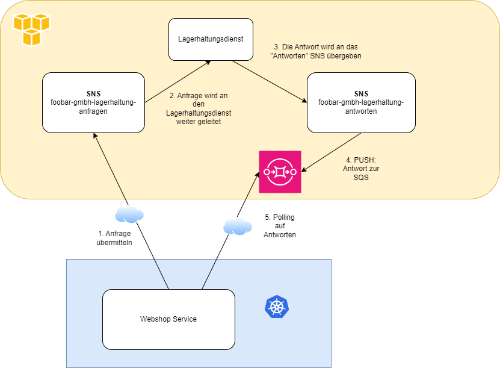

# Lösung

**Q: Wie sieht die Kommunikation hier aus? Wie unterscheidet sie sich von einer klassischen Request/Response-Kommunikation?**

In der klassischen Request/Response Kommunikation sendet ein Client eine Anfrage an den Server und bekommt daraufhin
(vielleicht auch etwas Zeit verzögert) die Antwort

 Client ---- Anfrage ----> Server 
 Server ---- Antwort ----> Client
 
Hier ist es eben anders. Die Anfragen werden an eine AWS SNS gesendet. Das ist ein Pub/Sub-Nachrichtendienst. 
Abonnierte Anwendungen oder Dienste erhalten automatisiert die Nachrichten. Hier kann natürlich wieder eine AWS SQS sein,
welche die Anfrage entgegennimmt. 
 * Sie senden eine Nachricht an die SNS 
   * Alle Abonnenten erhalten die Nachrichten. 
   * Die Nachricht wird nicht gespeichert.

Die gesendete Anfrage wird jedenfalls beim Lagerhaltungsdienst landen. Wird dort verarbeitet und die Antwort wird wiederum
an die "foobar-gmbh-lagerhaltung-antworten"-SNS übergeben. 

Nun bekommen alle Abonnenten der "foobar-gmbh-lagerhaltung-antworten"-Topic diese Nachricht übergeben. In unserem Fall ist es eine SQS. 
Die AWS SQS ist ein verwalteter Message-Queue-Service. Nachrichten werden erstmal (zeitlich begrenzt) gespeichert.

Nun kann der zukünftige Webshop die Antworten von der SQS wiederholt abfragen (polling) und verarbeiten. 

**Vielleicht hilft es Ihnen, sich eine Skizze zu zeichnen?**

